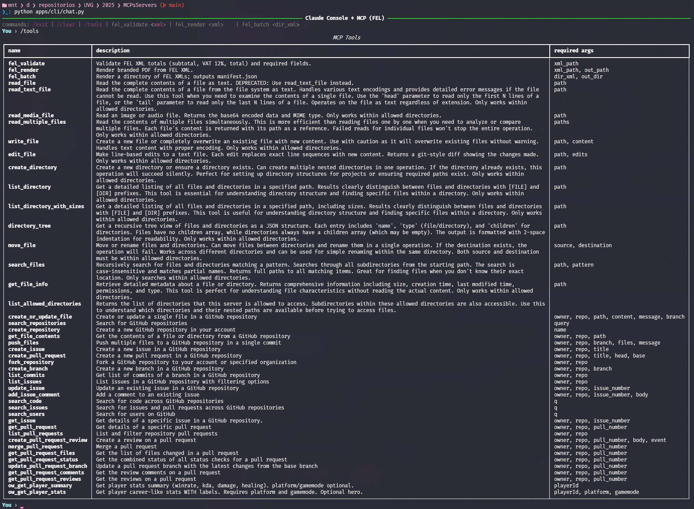
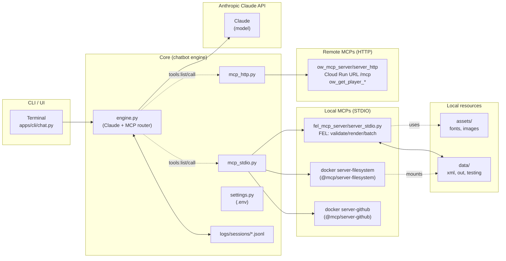

# Claude Console + MCP (FEL + Overwatch)

This project implements a **console chatbot** that connects to **Anthropic Claude** via API and integrates multiple **Model Context Protocol (MCP)** servers.
The chatbot can **maintain conversational context**, automatically decide when to use tools, and log all interactions in structured JSONL files.

It includes a **local FEL MCP** that validates and renders **Guatemalan electronic invoices (FEL)** in PDF with watermark, and a **remote Overwatch MCP (HTTP, cloud-deployed)** that allows querying player statistics.

> **Monorepo notice:** This repository consolidates two implemented codebases: the **chatbot (CLI/UI)** and the **local FEL MCP**.
> Additionally, it includes an **Overwatch MCP (HTTP, Cloud Run)** and links a reference repository for connection patterns.

## 🔗 Related Repositories

- [Chatbot (CLI / UI)](https://github.com/JosueSay/ChatBotMCP) — Integrated in this monorepo.
- [FEL MCP (Local)](https://github.com/JosueSay/MCPLocalFEL) — Integrated in this monorepo.
- [Reference: OpenAI Chat API Example](https://github.com/JosueSay/Selectivo_IA/blob/main/docs_assistant/README.md) — Reference only (connection patterns).

## ✨ Features

- Connects to **Anthropic Claude API** (LLM).
- Maintains conversational context throughout the session.
- Supports **manual and automatic tool usage**.
- Integrated tools:

  - **FEL MCP (local):**

    - `fel_validate`: validates XML totals (subtotal, 12% VAT, total).
    - `fel_render`: generates PDF invoices with watermark from XML.
    - `fel_batch`: processes multiple XML invoices → PDFs + manifest.json.
  - **Overwatch MCP (HTTP, cloud):**

    - `ow_get_player_summary`: summary of player stats (winrate, KDA, damage, healing).
    - `ow_get_player_stats`: full stats with tags (by role, hero, mode).
- Session logs saved in **structured JSONL**.
- Sandbox paths (`ALLOWED_ROOTS`) to prevent unsafe file access.

## ⚙️ Requirements

- **Python** 3.12
- **Ubuntu 22.04 (WSL)** or Linux environment
- Virtual environment (recommended)

## 🔧 Installation

When starting the chatbot, you can now run **multiple MCP servers in parallel**.
This allows combining local tools (e.g., FEL) with external integrations such as **Overwatch (HTTP cloud)**, **Filesystem**, and **GitHub**.

### Environment Variables

Edit your `.env` with the following variables:

```env
# ---- Keys ----
ANTHROPIC_API_KEY=your_key
ANTHROPIC_MODEL=claude-sonnet-4-20250514 # optional, other models: https://docs.anthropic.com/en/api/models-list
GITHUB_TOKEN=your_token # Personal Access Token (fine-grained or classic)

# ---- MCPS ----
MCP_FEL_CMD="/ABSOLUTE/PATH/venv/bin/python /ABSOLUTE/PATH/servers/fel_mcp_server/server_stdio.py"
MCP_URL=https://ow-mcp-server-XXXXXX.run.app/mcp # Your Overwatch MCP cloud URL

# Multiple MCPs (comma-separated)
# Recommended order: FEL (local), Filesystem (Docker), GitHub (Docker)
MCP_CMDS="/ABSOLUTE/PATH/venv/bin/python /ABSOLUTE/PATH/servers/fel_mcp_server/server_stdio.py,docker run --rm -i -v /ABSOLUTE/PATH/data/testing:/data node:22 npx -y @modelcontextprotocol/server-filesystem /data,docker run --rm -i -e GITHUB_TOKEN node:22 npx -y @modelcontextprotocol/server-github"

# ---- Chat Config ----
LOG_DIR=/ABSOLUTE/PATH/TO/REPO/data/logs/sessions
ROUTER_DEBUG=0 # 1: active | 0: inactive
```

### GitHub MCP

To use the **GitHub MCP**, you need to:

1. Create a **personal token** (fine-grained or classic).

2. Clone the official MCP servers repository to an absolute path:

   ```bash
   git clone https://github.com/modelcontextprotocol/servers.git
   ```

3. Replace `/ABSOLUTE/PATH/servers` in your `.env` with the actual cloned path.

This way, the chatbot can launch and orchestrate multiple MCPs in parallel.

## 🚀 Usage

Start the chatbot from the project root:

```bash
python apps/cli/chat.py
```

You will see something like:

```bash
───────────────────── Claude Console + MCP (FEL + Overwatch) ──────────────────────
commands: /exit | /clear | /tools
You ›
```

### FEL Example

```bash
You › /tools
MCP Tools
name         | description                                  | required args
-------------|----------------------------------------------|---------------
fel_validate | Validate FEL XML totals and required fields  | xml_path
fel_render   | Generate PDF with watermark from FEL XML     | xml_path
fel_batch    | Process FEL XML directory → manifest         | dir_xml
```

```bash
You › puedes validar precios de data/xml/factura.xml?
La validación de la factura fue exitosa. Los totales calculados son:

 • Subtotal: Q8,010.59  
 • IVA (12%): Q961.27  
 • Total: Q8,971.86  

No se encontraron errores en los precios ni en los campos requeridos.
```

### Overwatch Example (HTTP)

```bash
You › resume Overwatch stats for player YSE#11202 using ow_get_player_summary
Overall Performance:

 • 4,263 games played with a 52.8% winrate (2,251 wins, 2,012 losses)
 • 608 hours total playtime
 • 3.03 KDA ratio with 15.07 average eliminations per game

Role Distribution:

 • Tank: 1,699 games (51.85% winrate, 3.27 KDA)
 • Damage: 1,241 games (53.42% winrate, 3.08 KDA)
 • Support: 1,323 games (53.44% winrate, 2.64 KDA)

Top Heroes by Games Played:

 1 Doomfist - 523 games (47.8% winrate)
 2 Lucio - 332 games (58.73% winrate)
 3 Junkrat - 289 games (56.06% winrate)
 4 Reinhardt - 229 games (60.26% winrate)
 5 Cassidy - 203 games (55.17% winrate)

The player shows solid performance across all roles with slightly better winrates on damage and support heroes compared to tank. Lucio and Reinhardt appear to be among their strongest heroes with high winrates.
```

With absolute paths configured for official servers, you can now access more tools: **FEL + Overwatch (cloud) + Filesystem + GitHub**.



## 🗂 Project Structure

```bash
.
├── apps/
│   ├── cli/
│   │   └── chat.py             # Chatbot CLI frontend
│   └── ui/                     # Pending: possible UI frontend
├── core/
│   ├── engine.py               # Orchestration (Claude + MCP)
│   ├── mcp_stdio.py            # JSON-RPC client (MCP via stdio/local)
│   ├── mcp_http.py             # JSON-RPC client (MCP via HTTP/remote)
│   └── settings.py             # Configuration and environment variables
├── servers/
│   ├── fel_mcp_server/         # FEL MCP (validate, render, batch)
│   └── ow_mcp_server/          # Overwatch MCP (HTTP + stdio)
│       ├── config.py           # Constants (platforms, modes, roles)
│       ├── ow_api.py           # Overfast API calls (stats and summary)
│       ├── server_http.py      # MCP server via HTTP (cloud deployment)
│       └── server_stdio.py     # MCP server via stdio (for local use)
├── data/
│   ├── logos/                  # Company logos
│   ├── xml/                    # Example FEL invoice XMLs
│   ├── out/                    # Output PDFs
│   └── testing/                # Test files (filesystem MCP)
├── logs/sessions/              # Session logs (.jsonl)
├── assets/
│   ├── fonts/                  # Custom fonts (Montserrat, Roboto Mono)
│   └── images/                 # Icons (phone, email, web)
└── docs/                       # Project and MCP documentation
```

### Workflow



## 📝 Logs

Every session is automatically logged in `logs/sessions/` as **JSONL**.

Example log entries:

```json
{
  "type": "mcp",
  "op": "tools/list",
  "result": { ... }
}
{
  "type": "llm_auto",
  "model": "claude-sonnet-4-20250514",
  "input": "puedes validar precios de data/xml/factura.xml?",
  "output": "La validación de la factura fue exitosa..."
}
```

These logs allow you to trace **tool usage**, **LLM decisions**, and **outputs**.

## 🔒 Security Notes

- `ALLOWED_ROOTS` defines directories where MCP tools can access files (`data/xml`, `data/out`, `data/logos` by default).
- Any path outside of these roots will be **blocked** for safety.
- Logs may contain sensitive invoice data -> review before sharing.

## 🖥️ Using with Claude Desktop + MCP

You can also run the FEL server directly inside **Claude Desktop** via the [Model Context Protocol (MCP)](https://modelcontextprotocol.io).

### 1. Install Claude Desktop

Download and install Claude from here:
👉 [https://claude.ai/download](https://claude.ai/download)

> ⚠️ Claude Desktop is available for **Windows/macOS**.
>
> Our FEL server was designed to run inside **WSL (Ubuntu)**.

### 2. Configure MCP

Open Claude Desktop and go to:
**File -> Settings -> Developer -> Edit Config**

This will open the configuration folder. Edit the file `claude_desktop_config.json` and add:

```json
{
  "mcpServers": {
    "FEL": {
      "command": "wsl.exe",
      "args": [
        "-e",
        "<absolute_path>/venv/bin/python",
        "<absolute_path>/servers/fel_mcp_server/server_stdio.py"
      ]
    }
  }
}
```

🔑 **Note**:
Replace `<absolute_path>` with the full absolute path inside WSL, e.g.:
`/mnt/d/repositorios/UVG/2025/MCPsServers`

### 3. Restart Claude Desktop

After saving the config file, restart Claude Desktop from **PowerShell**:

```powershell
Stop-Process -Name "Claude" -Force; Start-Process "<absolute_path>\Claude.exe"
```

Here `<absolute_path>\Claude.exe` should be replaced with the full path to your Claude installation, for example:
`C:\Users\<username>\AppData\Local\AnthropicClaude\Claude.exe`

## 📝 Prompts for Testing

These are the prompts used for testing the chatbot. They differ in language to evaluate how well the chatbot adapts to Spanish and English inputs.

### Normal

```bash
¿Quién es Tom Cruise?
```

```bash
He's dead?
```

### FEL

```bash
Can you generate a PDF of data/xml/factura.xml?
```

```bash
¿Puedes verificar los precios de data/xml/factura.xml?
```

```bash
¿Cuánto sería el total si lo multiplicamos por 2?
```

### FileSystem

```bash
Lista todos los archivos que hay en el directorio /data/testing.
```

```bash
Read the complete contents of the /file data/testing/file1.txt.
```

### GitHub

```bash
Busca información del repositorio JosueSay/SchedulerSim y muéstrame su README.
```

```bash
Get the list of commits from the main branch of the repository JosueSay/SchedulerSim.
```

### MCP Remote OW

```bash
Dame un resumen de las estadísticas del jugador YSE#11202 en Overwatch (plataforma PC), incluyendo winrate, KDA, daño y sanación usando ow_get_player_summary.
```

```bash
Show me the detailed labeled career stats for the player YSE#11202 on PC in quickplay mode, using ow_get_player_stats.
```

## 🎬 Test Example

- [Watch the video with my chatbot](https://youtu.be/RaGJxHGllNY)
- [Watch the video with Claude Desktop](https://youtu.be/_vuhF7jKm1M)

## 📚 References

- [Model Context Protocol](https://modelcontextprotocol.io/)
- [Anthropic API Docs](https://docs.anthropic.com/en/api)
- [Antrhopic Build an MCP Server](https://modelcontextprotocol.io/quickstart/server)
- [JSON-RPC 2.0](https://www.jsonrpc.org/)
- [Overwatch API](https://github.com/TeKrop/overfast-api)
