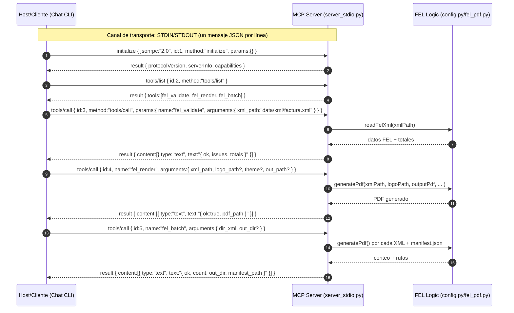

# MCP (Model Context Protocol) - Server FEL

Este documento describe cómo funciona el servidor MCP sin SDK (STDIN/STDOUT + JSON-RPC 2.0), su flujo de ejecución, parámetros de herramientas, retornos y cómo probarlo desde terminal. La referencia conceptual se basa en la arquitectura MCP pública de Anthropic y guías introductorias.

## 1. Qué es MCP en este contexto

* **Server (proveedor de capacidades)**: tu proceso `server_stdio.py`, que expone herramientas (`fel_validate`, `fel_render`, `fel_batch`) mediante **JSON-RPC 2.0** sobre STDIN/STDOUT.
* **Host / Cliente**: el proceso que inicia el server y envía llamadas MCP (por ejemplo, un chatbot de consola o un `printf` en terminal).
* **Mensajes clave**:

  * `initialize` -> handshake y declaración de capacidades.
  * `tools/list` -> listado de herramientas disponibles.
  * `tools/call` -> invocación de una herramienta con sus `arguments`.

## 2. Diagrama (Mermaid)



## 3. API de herramientas

### 3.1 `fel_validate`

* **Descripción**: Valida un XML FEL, audita **IVA 12 %** y **total = subtotal + IVA**, y verifica campos obligatorios.
* **Input (`arguments`)**:

  * `xml_path` (string, requerido): ruta al XML FEL.
* **Return (`result.content[0].text`)**: JSON como texto:

```json
{
  "ok": true,
  "issues": [],
  "totals": { "subtotal": "8010.59", "iva": "961.27", "total": "8971.86" }
}
```

* `ok` (bool): `true` si no hay inconsistencias.
* `issues` (string\[]): lista de inconsistencias detectadas.
* `totals` (strings): valores monetarios formateados con dos decimales.

### 3.2 `fel_render`

* **Descripción**: Genera un **PDF con marca** (logo, tipografías, colores) a partir de un XML FEL.
* **Input (`arguments`)**:

  * `xml_path` (string, requerido): ruta al XML FEL.
  * `logo_path` (string|null, opcional): ruta a un logo; si `null`, se usa `LOGO_PATH` por defecto.
  * `theme` (string|null, opcional): reservado para configuraciones futuras.
  * `out_path` (string|null, opcional): ruta de salida del PDF; si `null`, se usa `OUTPUT_PDF` por defecto.
* **Return**:

```json
{ "ok": true, "pdf_path": "data/out/factura.pdf" }
```

### 3.3 `fel_batch`

* **Descripción**: Procesa un directorio de XML FEL, genera un PDF por archivo y crea un `manifest.json`.
* **Input**:

  * `dir_xml` (string, requerido): directorio con archivos `*.xml`.
  * `out_dir` (string|null, opcional): directorio de salida (por defecto `data/out`).
* **Return**:

```json
{ "ok": true, "count": 5, "out_dir": "data/out", "manifest_path": "data/out/manifest.json" }
```

## 4. Contrato MCP implementado

* **Transporte**: STDIN/STDOUT, un mensaje JSON por línea.
* **Esquema JSON-RPC**: cada solicitud incluye `jsonrpc:"2.0"`, `id`, `method` y `params?`.
* **Métodos soportados**:

  * `initialize` -> devuelve `{ protocolVersion, serverInfo, capabilities }`.
  * `tools/list` -> devuelve `{ tools:[...] }` con `name`, `description` e `inputSchema` (JSON Schema).
  * `tools/call` -> recibe `{ name, arguments }`, ejecuta la herramienta y responde con `{ result: { content:[...] } }`.
* **Errores**: formato JSON-RPC estándar:

```json
{ "jsonrpc":"2.0", "id": <id>, "error": { "code": <int>, "message": "<desc>" } }
```

## 5. Parámetros y environment

El servidor utiliza `config.py`, que a su vez lee variables desde `.env`:

* **Entradas/Salidas**: `FEL_XML_PATH`, `FEL_LOGO_PATH`, `FEL_OUTPUT_PDF`.
* **Fuentes/Temas**: `FEL_ACTIVE_FONT`, `FEL_FONT_DIR_MONTSERRAT`, `FEL_FONT_DIR_ROBOTOMONO`, `FEL_THEME`.
* **Layout**: `FEL_QR_SIZE`, `FEL_TOP_BAR_HEIGHT`.
* **Footer**: `FEL_WEBSITE`, `FEL_PHONE`, `FEL_EMAIL`.

> En tiempo de ejecución, `fel_render` y `fel_batch` permiten rutas que sobrescriben los valores por defecto.

## 6. Flujo de ejecución

1. **Inicio**: el Host lanza `server_stdio.py` como subproceso.
2. **Handshake**: el Host envía `initialize`; el Server devuelve capacidades.
3. **Descubrimiento**: el Host consulta `tools/list` para conocer herramientas y esquemas.
4. **Invocación**: el Host llama `tools/call` con `{ name, arguments }`:

   * `fel_validate` -> extrae datos con `readFelXml()`, verifica IVA y totales, y retorna el diagnóstico.
   * `fel_render` -> llama `generatePdf()` con rutas/tema y devuelve la ruta del PDF.
   * `fel_batch` -> itera XMLs en `dir_xml`, genera PDFs y crea `manifest.json`.
5. **Resultado**: el Server encapsula la respuesta en `result.content[0].text` (JSON como texto) y la envía al Host.

## 7. Ejemplos de llamadas (terminal)

### 7.1 Inicialización y listado de herramientas

```bash
printf '%s\n' \
'{"jsonrpc":"2.0","id":1,"method":"initialize","params":{}}' \
'{"jsonrpc":"2.0","id":2,"method":"tools/list"}' \
| python servers/fel_mcp_server/server_stdio.py
```

### 7.2 Validación de XML

```bash
printf '%s\n' \
'{"jsonrpc":"2.0","id":1,"method":"initialize","params":{}}' \
'{"jsonrpc":"2.0","id":2,"method":"tools/list"}' \
'{"jsonrpc":"2.0","id":3,"method":"tools/call","params":{"name":"fel_validate","arguments":{"xml_path":"data/xml/factura.xml"}}}' \
| python servers/fel_mcp_server/server_stdio.py
```

### 7.3 Render de PDF

```bash
printf '%s\n' \
'{"jsonrpc":"2.0","id":1,"method":"initialize","params":{}}' \
'{"jsonrpc":"2.0","id":2,"method":"tools/list"}' \
'{"jsonrpc":"2.0","id":3,"method":"tools/call","params":{"name":"fel_render","arguments":{"xml_path":"data/xml/factura.xml","logo_path":"data/logos/logo.jpg","out_path":"data/out/factura.pdf"}}}' \
| python servers/fel_mcp_server/server_stdio.py
```

### 7.4 Lote y manifest

```bash
printf '%s\n' \
'{"jsonrpc":"2.0","id":1,"method":"initialize","params":{}}' \
'{"jsonrpc":"2.0","id":2,"method":"tools/list"}' \
'{"jsonrpc":"2.0","id":3,"method":"tools/call","params":{"name":"fel_batch","arguments":{"dir_xml":"data/xml","out_dir":"data/out"}}}' \
| python servers/fel_mcp_server/server_stdio.py
```

## 8. Consideraciones y buenas prácticas

* **Formato monetario**: parseo con `Decimal`, eliminando comas e imponiendo dos decimales (`ROUND_HALF_UP`).
* **Errores**:

  * Validar existencia de archivos (XML/Logo).
  * Asegurar permisos de escritura en `out_dir`.
  * Cualquier excepción se devuelve como `error` JSON-RPC.
* **Escalabilidad**:

  * Se puede añadir soporte a `resources` o `prompts` si el Host lo requiere.
  * Considerar cancelación si se gestionan tareas largas o streaming.

## 9. Estructura de archivos relevante

```bash
servers/
└─ fel_mcp_server/
   ├─ server_stdio.py     # MCP Server sin SDK
   ├─ config.py           # parámetros centralizados (lee .env)
   └─ fel_pdf.py          # readFelXml(), generatePdf(), helpers
```

*
