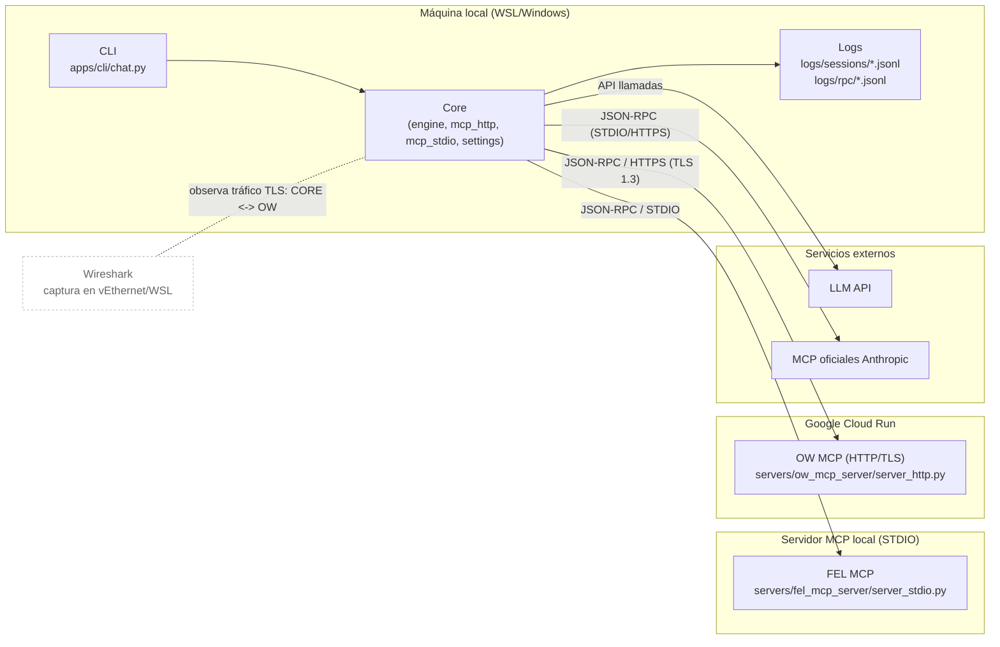
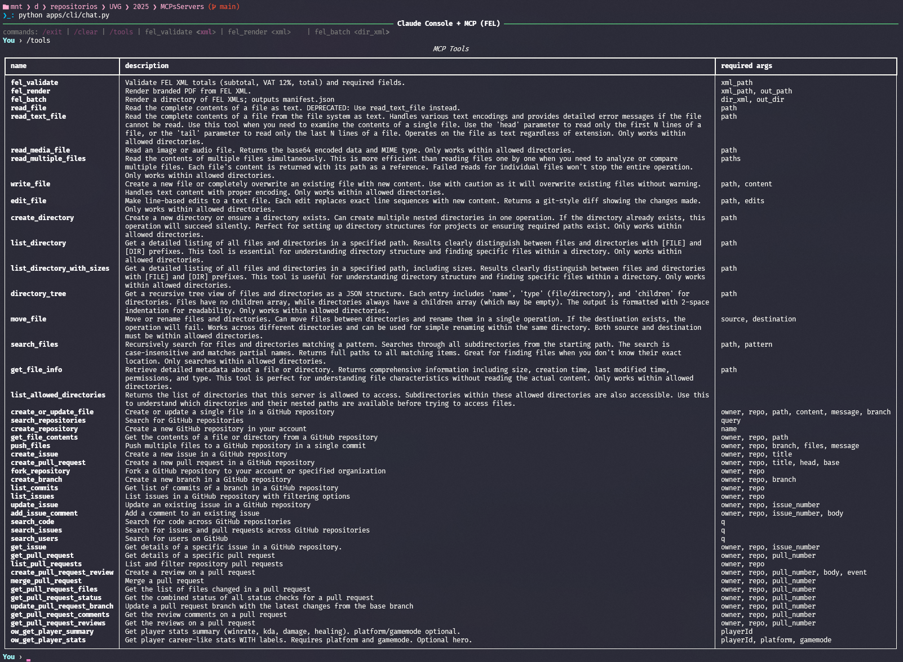
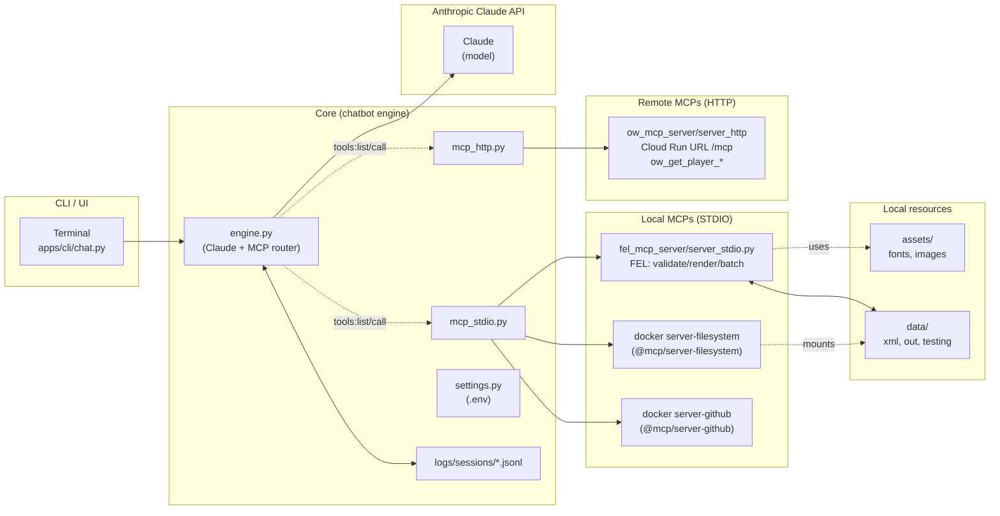
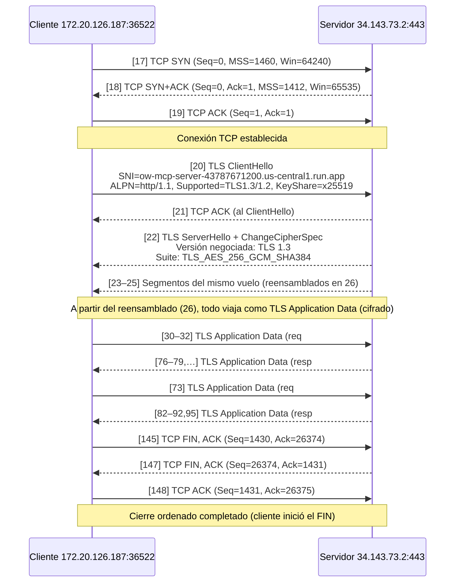
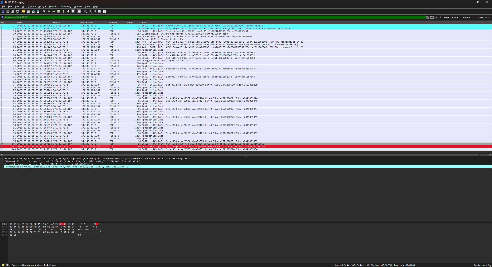
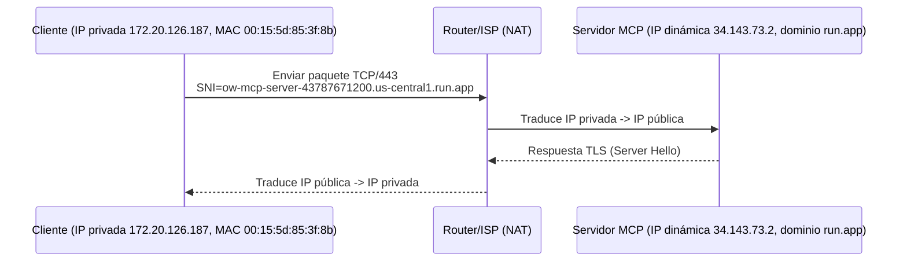
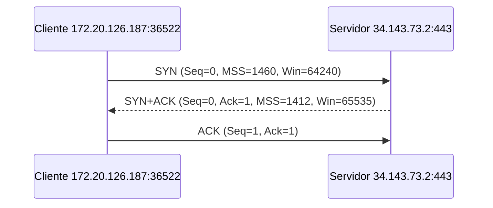
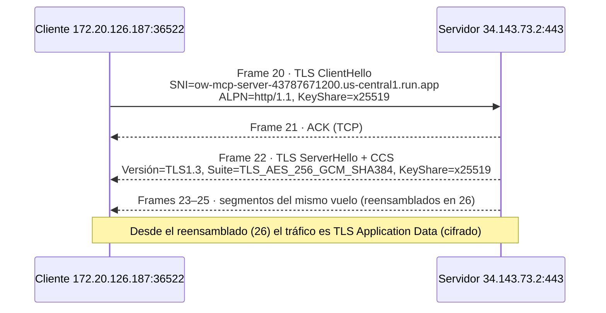
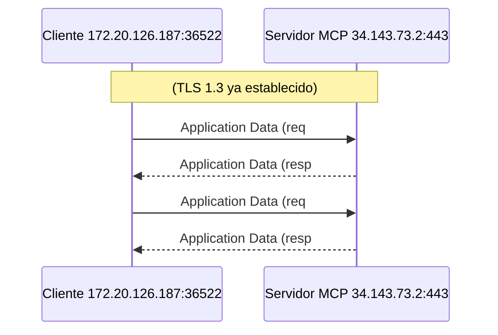
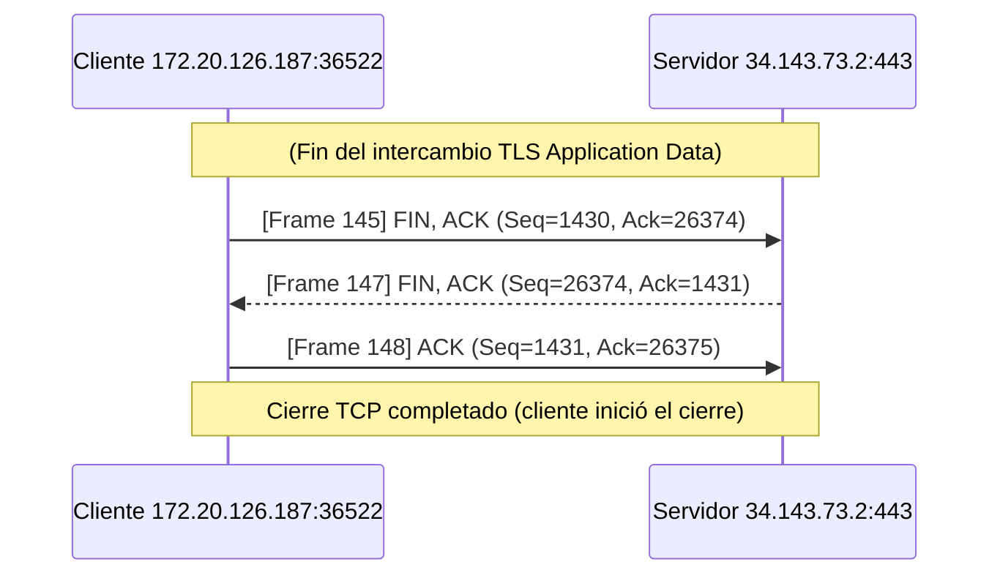

# Proyecto 1: Implementación de un protocolo existente

Este proyecto implementa, de extremo a extremo, el **protocolo MCP (Model Context Protocol)** en un chatbot que consume un **LLM vía API**. La solución integra **cuatro servidores MCP**:

1. **Local por STDIO** (FEL),
2. **Remoto por HTTP/TLS** desplegado en **Google Cloud Run** (OW), y
3. **Servidor oficial de Antrhopic** de FileSystem
4. **Servidor oficial de Antrhopic** de GitHub

El objetivo es **demostrar el protocolo MCP en funcionamiento** y evidenciarlo con una **captura y análisis en Wireshark** (capas **TCP/IP** y **TLS**).

El chatbot incluye una **CLI** con **contexto conversacional** y **persistencia de historial por sesión**. Cada sesión genera **logs JSONL** con los mensajes intercambiados y el estado del asistente; además, se registra en un archivo separado el **tráfico JSON-RPC (RPC logger)** para trazar el flujo MCP. Las **evidencias reproducibles** (PCAP y logs) permiten identificar el **3-way handshake TCP**, el **handshake TLS 1.3**, los **Application Data** (requests/responses cifrados) y el **cierre ordenado** de la conexión.
Como validación adicional, se probaron los **servidores MCP oficiales** (y el local) desde la **interfaz oficial de Claude**, verificando su compatibilidad.

# Índice

- [Documentación](#guía-para-uso)
- [Arquitectura del Sistema](#arquitectura-general-del-sistema)
- [Evidencia de uso](#evidencia-de-uso)
- [Análisis de Tráfico con Wireshark – Servidor MCP Remoto](#análisis-de-tráfico-con-wireshark--servidor-mcp-remoto)
- [Análisis por Capas (modelo TCP/IP)](#análisis-por-capas-modelo-tcpip)
- [Limitaciones actuales](#limitaciones-actuales)
- [Trabajo a futuro](#trabajo-futuro)
- [Lecciones aprendidas](#lecciones-aprendidas)
- [Conclusiones](#conclusiones)
- [Referencias](#referencias)

## Guía para uso

1. **Instalación y ejecución (obligatorio)**

   - Seguir el [README principal](https://github.com/JosueSay/MCPsServers/blob/main/README.md).

2. **Cómo está hecho el código (base del chatbot)**

   - Revisar [docs/code](https://github.com/JosueSay/MCPsServers/tree/main/docs/code).

3. **Qué es MCP y cómo fluye en este proyecto**

   - Ver [docs/mcp](https://github.com/JosueSay/MCPsServers/tree/main/docs/mcp).

4. **Servidor MCP local (STDIO, FEL)**

   - Leer [servers/fel_mcp_server/README.md](https://github.com/JosueSay/MCPsServers/blob/main/servers/fel_mcp_server/README.md).

5. **Servidor MCP remoto (HTTP/TLS en Cloud Run, OW)**

   - Leer [servers/ow_mcp_server/README.md](https://github.com/JosueSay/MCPsServers/blob/main/servers/ow_mcp_server/README.md).

6. **Evidencias para la rúbrica (Wireshark + logs)**

   - PCAP y logs: [docs/wireshark/data](https://github.com/JosueSay/MCPsServers/tree/main/docs/wireshark/data)

7. **Repos originales (este repo los combina)**

   - Chatbot + CLI: [ChatBotMCP](https://github.com/JosueSay/ChatBotMCP)
   - MCP local FEL: [MCPLocalFEL](https://github.com/JosueSay/MCPLocalFEL)
   - Repo combinado: [MCPsServers](https://github.com/JosueSay/MCPsServers)

> Para cada punto, seguir las instrucciones del README en la ruta indicada.

## Arquitectura general del sistema

- **Cliente local (CLI):** `apps/cli/chat.py` usando `core/engine.py`, `mcp_stdio.py`, `mcp_http.py`, `settings.py`.
- **Servidores MCP:**
  - **Local (STDIO/FEL):** `servers/fel_mcp_server/server_stdio.py`.
  - **Remoto (HTTP/TLS/Cloud Run):** `servers/ow_mcp_server/server_http.py`.
  - **Oficiales Anthropic:** accedidos como MCP externos (con estos se acceden llamando con un comando de docker en las variables de entorno como se mencionan en los README).
- **LLM vía API:** backend de lenguaje usado por el chatbot.
- **Evidencias/Logs:** `logs/sessions/*.jsonl`, `logs/rpc/*.jsonl`, capturas en `docs/wireshark/data/*.pcapng`.
- **Seguridad:** JSON-RPC del remoto viaja dentro de **HTTPS (TLS 1.3)**; el local usa **STDIO**.



# Evidencia de uso

- [Uso de MPC Para Tools en ChatBot](https://youtu.be/RaGJxHGllNY)
- [Uso de MCP Local en Claude Desktop](https://youtu.be/_vuhF7jKm1M)





# Análisis de Tráfico con Wireshark – Servidor MCP Remoto

Debajo se presenta un **recorrido end-to-end** de una sesión entre el chatbot (cliente, **172.20.126.187**) y el servidor MCP en **Google Cloud Run** (**34.143.73.2**). A partir de la captura en Wireshark, se confirmó el **3-way handshake** de TCP, el **handshake TLS 1.3** (ALPN y suite negociada) y, ya cifrado, el intercambio de **JSON-RPC** como *TLS Application Data*, para finalmente observar el **cierre ordenado** de la conexión. El análisis se apoyó en filtros como `tls.handshake.extensions_server_name contains "<dominio>"` e `ip.addr == 34.143.73.2`.





## 1. Identificación de cliente y servidor

Para montar el MCP remoto se utilizó **Google Cloud Run**, el cual provee una **URL pública**.  
Al hacer ping al dominio (`ow-mcp-server-43787671200.us-central1.run.app`) se obtuvo inicialmente una dirección **IPv6**.  
Sin embargo, en la práctica, Google Cloud asigna direcciones IPv4 dinámicas diferentes en cada conexión debido al balanceo de carga.

Para identificar la IP real usada por el chatbot, se aplicó en Wireshark el siguiente filtro:

```bash
tls.handshake.extensions_server_name contains "ow-mcp-server-43787671200.us-central1.run.app"
````

Este filtro permite localizar el **Client Hello** del handshake TLS, donde aparece el **SNI (Server Name Indication)** con el dominio del servidor.
En el **Frame 20** se observó que la conexión se estableció con la IP **34.143.73.2**.

Posteriormente, para observar todo el flujo de la sesión se aisló el tráfico con:

```bash
ip.addr == 34.143.73.2
```

### Frame 20 – Client Hello

- **Frame**

  - Número de frame: 20
  - Longitud: 583 bytes
  - Interfaz de captura: vEthernet (WSL – Hyper-V firewall)

- **Ethernet II**

  - Source MAC: `00:15:5d:85:3f:8b` (cliente local, adaptador virtual WSL)
  - Destination MAC: `00:15:5d:1c:a2:25` (gateway / siguiente salto)

- **Internet Protocol (IPv4)**

  - Source IP: `172.20.126.187` (cliente local, rango privado -> NAT)
  - Destination IP: `34.143.73.2` (servidor remoto en Google Cloud Run)

- **Transmission Control Protocol (TCP)**

  - Source Port: `36522` (puerto temporal del cliente)
  - Destination Port: `443` (HTTPS)
  - Flags: `PSH, ACK` (flujo de datos dentro de la conexión establecida)

- **Transport Layer Security (TLS)**

  - Handshake Protocol: `Client Hello`
  - Versión: TLS 1.2 / 1.3
  - Extensión SNI: `ow-mcp-server-43787671200.us-central1.run.app`



> **Nota:** La IP del cliente está en un rango privado. Para salir a Internet se traduce a una IP pública mediante el router/ISP. El servidor nunca ve directamente la IP privada, sino la IP pública asignada dinámicamente.

## 2. Handshake TCP (3-way handshake)

Antes de que se inicie cualquier comunicación segura con TLS, es necesario que el cliente y el servidor establezcan una conexión confiable mediante el **protocolo TCP**.  
Esto se logra a través del mecanismo **3-way handshake**, en el cual ambos extremos acuerdan los números de secuencia iniciales y confirman que están listos para transmitir datos.

En la captura de Wireshark se identificaron estos tres paquetes:

- **Frame 17 – SYN (Cliente -> Servidor)**  
  El cliente (`172.20.126.187:36522`) inicia la conexión enviando un segmento con la bandera `SYN` activada.  
  Este paquete incluye parámetros como el **Maximum Segment Size (MSS=1460)**, ventana inicial (`64240`), y la opción de timestamps.  
  Es el primer paso que indica la intención de abrir la conexión.

- **Frame 18 – SYN+ACK (Servidor -> Cliente)**  
  El servidor (`34.143.73.2:443`) responde con un paquete que contiene las banderas `SYN` y `ACK`.  
  Aquí se confirma la recepción del SYN del cliente (Ack=1) y el servidor propone sus propios parámetros (MSS=1412, Window Size=65535).  
  Esto representa la aceptación de la conexión por parte del servidor.

- **Frame 19 – ACK (Cliente -> Servidor)**  
  Finalmente, el cliente envía un `ACK` confirmando la recepción del SYN del servidor.  
  Con este último paso, la conexión TCP queda establecida y lista para iniciar el **handshake TLS**.



## 3. Handshake TLS (sincronización de aplicación segura)

Antes de enviar JSON-RPC, el canal se protege con **TLS 1.3**.
Tras el 3-way handshake de TCP, el cliente envía un **Client Hello** con el **SNI** del MCP; el servidor responde con **Server Hello** y **Change Cipher Spec**. Desde ese instante, todo pasa como **TLS Application Data** (cifrado).

- **Frame 20 — Client -> Server — `Client Hello`**

  - **IP origen/destino:** `172.20.126.187 -> 34.143.73.2`
  - **SNI:** `ow-mcp-server-43787671200.us-central1.run.app`
  - **ALPN:** `http/1.1`
  - **Versiones soportadas:** TLS 1.3 y 1.2

- **Frame 21 — Server -> Client — `ACK` del Client Hello**
  (confirma recepción, sin carga TLS)

- **Frame 22 — Server -> Client — `Server Hello` + `Change Cipher Spec`**

  - **Versión negociada:** TLS 1.3

- **Frames 23–25 — Server -> Client — segmentos TCP con el mismo vuelo del handshake**
  (se reensamblan en el **Frame 26** y a partir de allí el intercambio continúa cifrado como **Application Data**).

Esto quiere decir que **Frame 20** (Client Hello) -> **Frame 22** (Server Hello/CCS) son los centrales del handshake TLS. Por otro lado **Frame 21** es un ACK TCP y **Frames 23–25** son fragmentos del mismo vuelo hasta el reensamblado (**Frame 26**). Desde **26** en adelante: **TLS Application Data**.



- **Sincronización:**

  - **TCP:** Frames **17–19** (SYN, SYN+ACK, ACK).
  - **TLS:** Frames **20** (Client Hello) y **22** (Server Hello/CCS) + sus segmentos **23–25** (reensamblados en 26).
- **Request (MCP):** **TLS Application Data** del **cliente -> servidor** después del frame 26.
- **Response (MCP):** **TLS Application Data** del **servidor -> cliente** después del frame 26.

> En Wireshark el contenido JSON no es visible (va cifrado). Para evidenciar el **MCP en funcionamiento**, dr adjuntan los log locales tomados desde el chatbot.

```json
{"time": "2025-09-10T16:08:37.057992", "direction": "send", "data": {"jsonrpc":"2.0","id":1,"method":"initialize","params":{}}}
{"time": "2025-09-10T16:08:38.026136", "direction": "recv", "data": {"jsonrpc":"2.0","id":1,"result":{"protocolVersion":"2025-06-18","serverInfo":{"name":"fel-stdio","version":"0.1.0"},"capabilities":{"tools":{"listChanged": true}}}}}
{"time": "2025-09-10T16:08:38.028420", "direction": "send", "data": {"jsonrpc":"2.0","id":2,"method":"tools/list"}}
{"time": "2025-09-10T16:08:38.034824", "direction": "recv", "data": {"jsonrpc":"2.0","id":2,"result":{"tools":[{"name":"fel_validate", "description":"Validate FEL XML totals ..."}]}}}
```

> En el repositorio en la carpeta `wireshark` se comparte los logs tanto de sesión como de rpc. En el caso de rpc estos mensajes **viajaron dentro** de los registros **TLS Application Data** observados tras el frame de reensamblado (26).

## 4. Intercambio de datos (Application Data)

En Wireshark no veremos el JSON-RPC "en claro". Pero con filtros sí podemos observar es **quién habla con quién, cuándo y cuánto envía** y para ello se aplicaron estos filtros:

```bash
# Requests (cliente -> servidor MCP)
ip.src == 172.20.126.187 && tls

# Responses (servidor MCP -> cliente)
ip.src == 34.143.73.2 && tls
```

### Paquetes relevantes en la captura

| Dirección              |                                             Frames | Qué vemos                                                                                                                                                                   |
| ---------------------- | -------------------------------------------------: | --------------------------------------------------------------------------------------------------------------------------------------------------------------------------- |
| **Cliente -> Servidor** |                                 **30, 31, 32, 73** | Primer "burst" de **Application Data** del cliente hacia `34.143.73.2:443` (tras `Change Cipher Spec`). Estos son **requests JSON-RPC** cifrados.                           |
| **Servidor -> Cliente** | **76, 77, 78, 79, 82, 83, 85, 86, 88, 91, 92, 95** | Respuestas del servidor en varios segmentos de **1466 B** (MTU/ETH típica). Son **responses JSON-RPC** cifradas que llegan en ráfagas y se confirman con ACKs intercalados. |

> Nota: En medio hay ACKs puros (**Frame 75**) sin carga útil (Len=0). No se listaron como datos de aplicación.

- **Frames 30–32** (cliente -> servidor): `TLSv1.3 Application Data` aparece inmediatamente después del `ClientHello` y `ServerHello`. Representan el **primer envío** del cliente, que incluye las peticiones `initialize` y `tools/list`.
- **Frame 73** (cliente -> servidor): el cliente realiza un nuevo envío de datos de aplicación con otra petición JSON-RPC.
- **Frames 76–77, 78–79, ...** (servidor -> cliente): se observan **bloques de 1466 bytes** continuos con `PSH, ACK`. Wireshark indica que estos se reensamblan en PDUs de mayor tamaño, correspondientes a las **respuestas** de las peticiones (`initialize`, `tools/list`, `tools/call`).

> Nota:
>
> - **`PSH, ACK`** en estos registros indica "entrega inmediata" al socket de la aplicación y confirmación del flujo.
> - **ACKs** del otro lado (Len=0) confirman recepción y controlan la ventana (flujo).

### Ejemplos de mensajes JSON-RPC

Estos **no se ven en Wireshark** por ir cifrados, de parte del logger de nuestro chatbot vemos los json-rpc:

```json
{"time":"...", "direction":"send", "data":{"jsonrpc":"2.0","id":1,"method":"initialize","params":{}}}
{"time":"...", "direction":"recv", "data":{"jsonrpc":"2.0","id":1,"result":{"protocolVersion":"2025-06-18","serverInfo":{"name":"fel-stdio","version":"0.1.0"}}}}

{"time":"...", "direction":"send", "data":{"jsonrpc":"2.0","id":2,"method":"tools/list"}}
{"time":"...", "direction":"recv", "data":{"jsonrpc":"2.0","id":2,"result":{"tools":[{"name":"fel_validate"}, {"name":"fel_render"}, {"name":"fel_batch"}]}}}
```



## 5. Cierre de conexión

Al finalizar el intercambio de datos cifrados (TLS *Application Data*), la sesión se cierra a nivel **TCP**. En esta conversación específica:

- **Frame 145 – Cliente -> Servidor: `FIN, ACK`**
  `172.20.126.187:36522` -> `34.143.73.2:443`
  **Seq=1430, Ack=26374, Len=0**.
  El **cliente inicia el cierre**.

- **Frame 147 – Servidor -> Cliente: `FIN, ACK`**
  `34.143.73.2:443` -> `172.20.126.187:36522`
  **Seq=26374, Ack=1431, Len=0**.
  El servidor **acknowledgea el FIN del cliente** (nota el **Ack=1431 = 1430+1** porque **FIN consume un número de secuencia**) y a la vez **envía su propio FIN**.

- **Frame 148 – Cliente -> Servidor: `ACK`**
  `172.20.126.187:36522` -> `34.143.73.2:443`
  **Seq=1431, Ack=26375, Len=0**.
  El cliente **confirma el FIN del servidor** y la conexión queda cerrada.

### Diagrama del cierre (flujo TCP)



> Nota:
>
> - Para encontrar el **FIN del servidor** (Frame 147):
>
> ```wireshark
> tcp.flags.fin == 1 && ip.addr == 34.143.73.2
>  ```

# Análisis por Capas (modelo TCP/IP)

Para este análisis se utilizó el modelo TCP/IP de 4 capas `Acceso a red -> Internet -> Transporte -> Aplicación`.

## 1. Capa de Acceso a red (enlace + física)

Transmisión local en Ethernet: tramas con **MAC origen/destino**, MTU $\approx$ 1500 B.

- En el **Frame 20** se ven las MAC del host WSL (`00:15:5d:85:3f:8b`) y del gateway/bridge (`00:15:5d:1c:a2:25`).
- Los segmentos con **1466 B** de "TLSv1.3 Application Data" (p. ej. frames **76–79**) cuadran con **TCP payload \~1400 B** + **cabeceras IP/TCP** para no superar la MTU Ethernet (\~1500 B).
- Filtro útil: `ip.addr == 34.143.73.2`.

## 2. Capa de Internet (IP)

Direccionamiento y enrutamiento **IP**. También se captó **NAT**: el cliente usa IP **privada** y sale con IP **pública** a Internet (**IP\:puerto privado <-> IP\:puerto público**) y los rangos **RFC1918** (10/8, 172.16/12, 192.168/16).

- **Cliente:** `172.20.126.187` (rango privado 172.16–172.31).
- **Servidor (Cloud Run):** `34.143.73.2` (IP pública, puede cambiar por balanceo).
- Filtros que usaste:

  - Por **destino**: `ip.addr == 34.143.73.2`
  - Para **SNI** (descubrir IP real del MCP):
    `tls.handshake.extensions_server_name contains "ow-mcp-server-43787671200.us-central1.run.app"`

## 3. Capa de Transporte (TCP)

**TCP** provee comunicación **orientada a conexión**, confiable: **3-way handshake**, números de **secuencia/ack**, **control de flujo/ventana**, **retransmisión**, **SACK**, **escalado de ventana**, y cierre **ordenado (FIN/ACK)** (el `SYN` cuenta como **1 byte lógico** y por eso el `ACK` incrementa en +1).

- **Establecimiento (3-way handshake)**

  - **\[17]** `SYN` cliente -> servidor
  - **\[18]** `SYN+ACK` servidor -> cliente
  - **\[19]** `ACK` cliente -> servidor
    (con **MSS**, **Window Scale**, **SACK Permitted** en opciones TCP).
- **Datos cifrados fluyendo sobre TCP:**
  tras el TLS handshake, ves `TLS Application Data` (p. ej. **30–32** cliente->servidor y **76–79** servidor->cliente).
- **Cierre ordenado:**
  - **\[145]** Cliente envía `FIN,ACK`
  - **\[147]** Servidor responde `FIN,ACK`
  - **\[148]** Cliente `ACK` final

## 4. Capa de Aplicación

Aquí viven los protocolos de aplicación. Como se vió en el curso MCP es un protocolo de capa de aplicación, junto con HTTP/DNS, etc.

- **TLS 1.3 sobre TCP/443** protege la aplicación:
  - **\[20]** `TLS ClientHello` (SNI del MCP; **ALPN: http/1.1**)
  - **\[22]** `TLS ServerHello + ChangeCipherSpec` (negocia **TLS 1.3**)
  - Desde el reensamblado (frame **26**) todo es **`TLS Application Data`** (cifrado).
- **Contenido real (JSON-RPC del MCP)**: no es visible en Wireshark por el cifrado pero se evidencia con logs para `initialize`, `tools/list`, `tools/call`. En este proceso la app se comunican por pares a través de esta capa.

# Limitaciones actuales

**Protocolo MCP (implementación mínima).**
El servidor local por STDIO implementa únicamente `initialize`, `tools/list` y `tools/call`. No hay soporte para cancelación de llamadas, notificaciones específicas (más allá de ignorarlas), *streaming* de resultados ni control de sesiones desde el lado del servidor. El *loop* principal procesa "un JSON-RPC por línea" y descarta notificaciones sin `id`, lo que simplifica, pero también limita concurrencia y extensibilidad.

**Acoplamiento al formato JSON-RPC/Claude.**
Para que Claude acepte respuestas de herramientas, se "aplana" el resultado en el sobre MCP (`{"content": [{"type":"text","text": "..."}]}`) en lugar de devolver objetos tipados.

**Observabilidad y trazabilidad.**
El tráfico TLS no se puede desencriptar en Wireshark (no se usa `SSLKEYLOGFILE`), así que la correlación "paquete <-> JSON-RPC".

**FEL específico.**
El *parser* de FEL asume un namespace y estructura concreta (SAT Guatemala) y extrae campos por XPath fijos, no valida contra XSD ni maneja variaciones de esquema. El cálculo de IVA/total está fijo al 12% y depende de redondeos y si hay cambios en el formato se rompería la lógica.

**UX y distribución.**
La interacción principal es por CLI, no hay UI web/escritorio para usuarios no técnicos. El despliegue remoto funciona en Cloud Run, pero la IP es dinámica (balanceo) los filtros usados en wireshark van variando de acuerdo al dominio/SNI.

# Trabajo futuro

- Adoptar SDK oficial MCP o ampliar la implementación.
- Autenticación/autorización para MCP remoto.
- Límites: tamaño máximo de petición/respuesta, tiempo de ejecución y cuota por herramienta.
- UI web simple (lista de herramientas, formularios para argumentos, vista de resultados y log en vivo).
- Historial navegable por sesión con exportación a JSONL y descarga del PDF generado (FEL).
- Validación XSD del FEL, manejo de múltiples versiones SAT, soporte de varios ítems y totales, multi-moneda.

# Lecciones aprendidas

**Compatibilidad estricta con MCP/JSON-RPC.**
Claude es muy estricto con el sobre de respuesta: devolver `content` como bloques y evitar cualquier salida en STDOUT distinta al JSON-RPC. La decisión de "aplanar" los resultados simplificó la compatibilidad a costa de tipado. Usar `stderr` para depurar evitó romper el canal.

**Capas y aislamiento de preocupaciones.**
Entender cómo **SYN/SYN-ACK/ACK** prepara el canal, cómo **TLS 1.3** negocia claves (SNI, ALPN, *key share*) y cómo todo lo demás es "solo bytes cifrados", ayuda a no mezclar responsabilidades. Esta visión permite cambiar el transporte (HTTP/1.1 → HTTP/2) sin tocar lógica MCP.

**Dominio FEL.**
Trabajar con FEL exige **validación formal del XML** y tolerancia a cambios. La lógica actual funciona para el XML de ejemplo, pero endurecer validaciones y pruebas es clave para ambientes reales.  

# Conclusiones

- Se integró un **LLM vía API** con **cuatro servidores MCP** (STDIO local FEL, remoto HTTP/TLS en Cloud Run y dos oficiales) y se demostró el protocolo en funcionamiento capturando el **3-way handshake TCP**, el **handshake TLS 1.3** y el flujo de **Application Data cifrado**.
- En el lado servidor STDIO se implementó el núcleo de MCP (initialize, tools/list, tools/call) con un bucle robusto de JSON-RPC "una línea/un mensaje", suficiente para las demostraciones y la automatización principal.
- A nivel de capas, la práctica reafirmó la separación de responsabilidades: **TCP** garantiza fiabilidad; **TLS** aporta confidencialidad e integridad; la **aplicación** se concentra en el contrato JSON-RPC/MCP sin "re-inventar" transporte o cifrado.
- Los MCP's fueron una herramienta que le dió un uso mucho mayor a los LLM's para incrementar su valor así como el uso de FEL para automatizar el estilizado de facturas.

# Referencias

- Notas del curso.
- [Model Context Protocol](https://modelcontextprotocol.io/)
- [Anthropic API Docs](https://docs.anthropic.com/en/api)
- [Antrhopic Build an MCP Server](https://modelcontextprotocol.io/quickstart/server)
- [JSON-RPC 2.0](https://www.jsonrpc.org/)
- [Overwatch API](https://github.com/TeKrop/overfast-api)
- [Reference: OpenAI Chat API Example](https://github.com/JosueSay/Selectivo_IA/blob/main/docs_assistant/README.md)
- [IBM (lectura complementaria del stack TCP/IP)](https://www.ibm.com/docs/es/aix/7.2.0?topic=protocol-tcpip-protocols)
