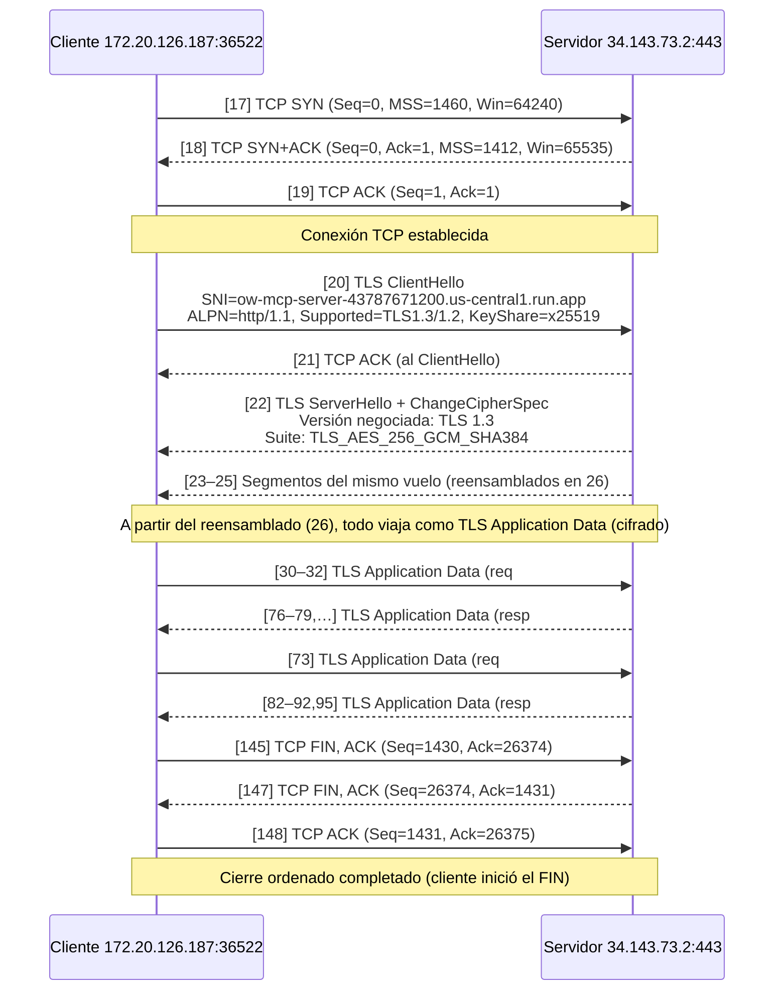
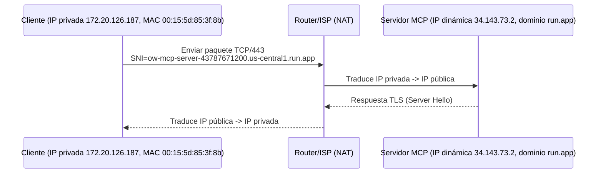
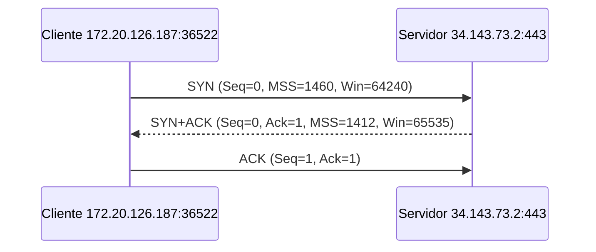
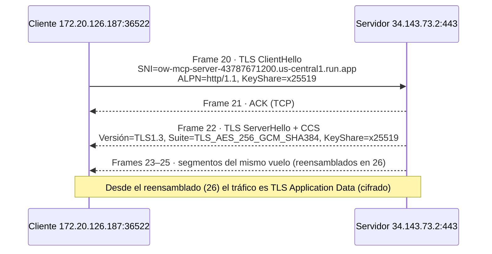
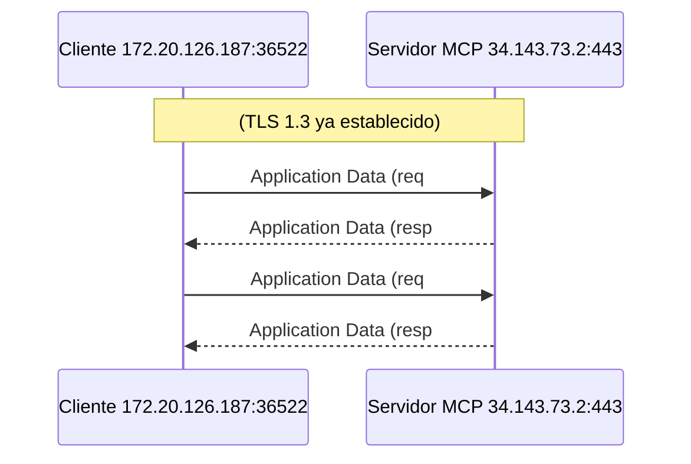
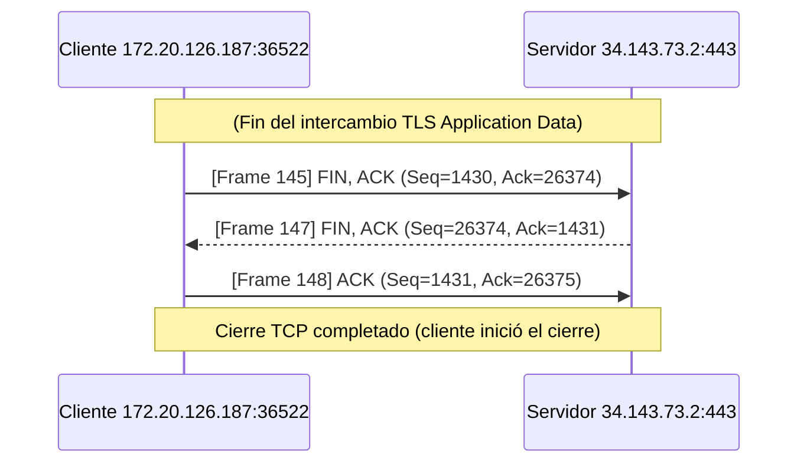

# Análisis de Tráfico con Wireshark – Servidor MCP Remoto

Debajo se presenta un **recorrido end-to-end** de una sesión entre el chatbot (cliente, **172.20.126.187**) y el servidor MCP en **Google Cloud Run** (**34.143.73.2**). A partir de la captura en Wireshark, se confirmó el **3-way handshake** de TCP, el **handshake TLS 1.3** (ALPN y suite negociada) y, ya cifrado, el intercambio de **JSON-RPC** como *TLS Application Data*, para finalmente observar el **cierre ordenado** de la conexión. El análisis se apoyó en filtros como `tls.handshake.extensions_server_name contains "<dominio>"` e `ip.addr == 34.143.73.2`.



## 1. Identificación de cliente y servidor

Para montar el MCP remoto se utilizó **Google Cloud Run**, el cual provee una **URL pública**.  
Al hacer ping al dominio (`ow-mcp-server-43787671200.us-central1.run.app`) se obtuvo inicialmente una dirección **IPv6**.  
Sin embargo, en la práctica, Google Cloud asigna direcciones IPv4 dinámicas diferentes en cada conexión debido al balanceo de carga.

Para identificar la IP real usada por el chatbot, se aplicó en Wireshark el siguiente filtro:

```bash
tls.handshake.extensions_server_name contains "ow-mcp-server-43787671200.us-central1.run.app"
````

Este filtro permite localizar el **Client Hello** del handshake TLS, donde aparece el **SNI (Server Name Indication)** con el dominio del servidor.
En el **Frame 20** se observó que la conexión se estableció con la IP **34.143.73.2**.

Posteriormente, para observar todo el flujo de la sesión se aisló el tráfico con:

```bash
ip.addr == 34.143.73.2
```

### Frame 20 – Client Hello

- **Frame**

  - Número de frame: 20
  - Longitud: 583 bytes
  - Interfaz de captura: vEthernet (WSL – Hyper-V firewall)

- **Ethernet II**

  - Source MAC: `00:15:5d:85:3f:8b` (cliente local, adaptador virtual WSL)
  - Destination MAC: `00:15:5d:1c:a2:25` (gateway / siguiente salto)

- **Internet Protocol (IPv4)**

  - Source IP: `172.20.126.187` (cliente local, rango privado -> NAT)
  - Destination IP: `34.143.73.2` (servidor remoto en Google Cloud Run)

- **Transmission Control Protocol (TCP)**

  - Source Port: `36522` (puerto temporal del cliente)
  - Destination Port: `443` (HTTPS)
  - Flags: `PSH, ACK` (flujo de datos dentro de la conexión establecida)

- **Transport Layer Security (TLS)**

  - Handshake Protocol: `Client Hello`
  - Versión: TLS 1.2 / 1.3
  - Extensión SNI: `ow-mcp-server-43787671200.us-central1.run.app`



> **Nota:** La IP del cliente está en un rango privado. Para salir a Internet se traduce a una IP pública mediante el router/ISP. El servidor nunca ve directamente la IP privada, sino la IP pública asignada dinámicamente.

## 2. Handshake TCP (3-way handshake)

Antes de que se inicie cualquier comunicación segura con TLS, es necesario que el cliente y el servidor establezcan una conexión confiable mediante el **protocolo TCP**.  
Esto se logra a través del mecanismo **3-way handshake**, en el cual ambos extremos acuerdan los números de secuencia iniciales y confirman que están listos para transmitir datos.

En la captura de Wireshark se identificaron estos tres paquetes:

- **Frame 17 – SYN (Cliente -> Servidor)**  
  El cliente (`172.20.126.187:36522`) inicia la conexión enviando un segmento con la bandera `SYN` activada.  
  Este paquete incluye parámetros como el **Maximum Segment Size (MSS=1460)**, ventana inicial (`64240`), y la opción de timestamps.  
  Es el primer paso que indica la intención de abrir la conexión.

- **Frame 18 – SYN+ACK (Servidor -> Cliente)**  
  El servidor (`34.143.73.2:443`) responde con un paquete que contiene las banderas `SYN` y `ACK`.  
  Aquí se confirma la recepción del SYN del cliente (Ack=1) y el servidor propone sus propios parámetros (MSS=1412, Window Size=65535).  
  Esto representa la aceptación de la conexión por parte del servidor.

- **Frame 19 – ACK (Cliente -> Servidor)**  
  Finalmente, el cliente envía un `ACK` confirmando la recepción del SYN del servidor.  
  Con este último paso, la conexión TCP queda establecida y lista para iniciar el **handshake TLS**.



## 3. Handshake TLS (sincronización de aplicación segura)

Antes de enviar JSON-RPC, el canal se protege con **TLS 1.3**.
Tras el 3-way handshake de TCP, el cliente envía un **Client Hello** con el **SNI** del MCP; el servidor responde con **Server Hello** y **Change Cipher Spec**. Desde ese instante, todo pasa como **TLS Application Data** (cifrado).

- **Frame 20 — Client -> Server — `Client Hello`**

  - **IP origen/destino:** `172.20.126.187 -> 34.143.73.2`
  - **SNI:** `ow-mcp-server-43787671200.us-central1.run.app`
  - **ALPN:** `http/1.1`
  - **Versiones soportadas:** TLS 1.3 y 1.2

- **Frame 21 — Server -> Client — `ACK` del Client Hello**
  (confirma recepción, sin carga TLS)

- **Frame 22 — Server -> Client — `Server Hello` + `Change Cipher Spec`**

  - **Versión negociada:** TLS 1.3

- **Frames 23–25 — Server -> Client — segmentos TCP con el mismo vuelo del handshake**
  (se reensamblan en el **Frame 26** y a partir de allí el intercambio continúa cifrado como **Application Data**).

Esto quiere decir que **Frame 20** (Client Hello) -> **Frame 22** (Server Hello/CCS) son los centrales del handshake TLS. Por otro lado **Frame 21** es un ACK TCP y **Frames 23–25** son fragmentos del mismo vuelo hasta el reensamblado (**Frame 26**). Desde **26** en adelante: **TLS Application Data**.

### Diagrama (TLS 1.3 sobre la conexión ya abierta)



- **Sincronización:**

  - **TCP:** Frames **17–19** (SYN, SYN+ACK, ACK).
  - **TLS:** Frames **20** (Client Hello) y **22** (Server Hello/CCS) + sus segmentos **23–25** (reensamblados en 26).
- **Request (MCP):** **TLS Application Data** del **cliente -> servidor** después del frame 26.
- **Response (MCP):** **TLS Application Data** del **servidor -> cliente** después del frame 26.

> En Wireshark el contenido JSON no es visible (va cifrado). Para evidenciar el **MCP en funcionamiento**, dr adjuntan los log locales tomados desde el chatbot.

```json
{"time": "2025-09-10T16:08:37.057992", "direction": "send", "data": {"jsonrpc":"2.0","id":1,"method":"initialize","params":{}}}
{"time": "2025-09-10T16:08:38.026136", "direction": "recv", "data": {"jsonrpc":"2.0","id":1,"result":{"protocolVersion":"2025-06-18","serverInfo":{"name":"fel-stdio","version":"0.1.0"},"capabilities":{"tools":{"listChanged": true}}}}}
{"time": "2025-09-10T16:08:38.028420", "direction": "send", "data": {"jsonrpc":"2.0","id":2,"method":"tools/list"}}
{"time": "2025-09-10T16:08:38.034824", "direction": "recv", "data": {"jsonrpc":"2.0","id":2,"result":{"tools":[{"name":"fel_validate", "description":"Validate FEL XML totals ..."}]}}}
```

> En el repositorio en la carpeta `wireshark` se comparte los logs tanto de sesión como de rpc. En el caso de rpc estos mensajes **viajaron dentro** de los registros **TLS Application Data** observados tras el frame de reensamblado (26).

## 4. Intercambio de datos (Application Data)

En Wireshark no veremos el JSON-RPC "en claro". Pero con filtros sí podemos observar es **quién habla con quién, cuándo y cuánto envía** y para ello se aplicaron estos filtros:

```bash
# Requests (cliente -> servidor MCP)
ip.src == 172.20.126.187 && tls

# Responses (servidor MCP -> cliente)
ip.src == 34.143.73.2 && tls
```

### Paquetes relevantes en la captura

| Dirección              |                                             Frames | Qué vemos                                                                                                                                                                   |
| ---------------------- | -------------------------------------------------: | --------------------------------------------------------------------------------------------------------------------------------------------------------------------------- |
| **Cliente -> Servidor** |                                 **30, 31, 32, 73** | Primer "burst" de **Application Data** del cliente hacia `34.143.73.2:443` (tras `Change Cipher Spec`). Estos son **requests JSON-RPC** cifrados.                           |
| **Servidor -> Cliente** | **76, 77, 78, 79, 82, 83, 85, 86, 88, 91, 92, 95** | Respuestas del servidor en varios segmentos de **1466 B** (MTU/ETH típica). Son **responses JSON-RPC** cifradas que llegan en ráfagas y se confirman con ACKs intercalados. |

> Nota: En medio hay ACKs puros (**Frame 75**) sin carga útil (Len=0). No se listaron como datos de aplicación.

- **Frames 30–32** (cliente -> servidor): `TLSv1.3 Application Data` aparece inmediatamente después del `ClientHello` y `ServerHello`. Representan el **primer envío** del cliente, que incluye las peticiones `initialize` y `tools/list`.
- **Frame 73** (cliente -> servidor): el cliente realiza un nuevo envío de datos de aplicación con otra petición JSON-RPC.
- **Frames 76–77, 78–79, ...** (servidor -> cliente): se observan **bloques de 1466 bytes** continuos con `PSH, ACK`. Wireshark indica que estos se reensamblan en PDUs de mayor tamaño, correspondientes a las **respuestas** de las peticiones (`initialize`, `tools/list`, `tools/call`).

> Nota:
>
> - **`PSH, ACK`** en estos registros indica "entrega inmediata" al socket de la aplicación y confirmación del flujo.
> - **ACKs** del otro lado (Len=0) confirman recepción y controlan la ventana (flujo).

### Ejemplos de mensajes JSON-RPC

Estos **no se ven en Wireshark** por ir cifrados, de parte del logger de nuestro chatbot vemos los json-rpc:

```json
{"time":"...", "direction":"send", "data":{"jsonrpc":"2.0","id":1,"method":"initialize","params":{}}}
{"time":"...", "direction":"recv", "data":{"jsonrpc":"2.0","id":1,"result":{"protocolVersion":"2025-06-18","serverInfo":{"name":"fel-stdio","version":"0.1.0"}}}}

{"time":"...", "direction":"send", "data":{"jsonrpc":"2.0","id":2,"method":"tools/list"}}
{"time":"...", "direction":"recv", "data":{"jsonrpc":"2.0","id":2,"result":{"tools":[{"name":"fel_validate"}, {"name":"fel_render"}, {"name":"fel_batch"}]}}}
```



## 5. Cierre de conexión

Al finalizar el intercambio de datos cifrados (TLS *Application Data*), la sesión se cierra a nivel **TCP**. En esta conversación específica:

- **Frame 145 – Cliente -> Servidor: `FIN, ACK`**
  `172.20.126.187:36522` -> `34.143.73.2:443`
  **Seq=1430, Ack=26374, Len=0**.
  El **cliente inicia el cierre**.

- **Frame 147 – Servidor -> Cliente: `FIN, ACK`**
  `34.143.73.2:443` -> `172.20.126.187:36522`
  **Seq=26374, Ack=1431, Len=0**.
  El servidor **acknowledgea el FIN del cliente** (nota el **Ack=1431 = 1430+1** porque **FIN consume un número de secuencia**) y a la vez **envía su propio FIN**.

- **Frame 148 – Cliente -> Servidor: `ACK`**
  `172.20.126.187:36522` -> `34.143.73.2:443`
  **Seq=1431, Ack=26375, Len=0**.
  El cliente **confirma el FIN del servidor** y la conexión queda cerrada.

### Diagrama del cierre (flujo TCP)



> Nota:
>
> - Para encontrar el **FIN del servidor** (Frame 147):
>
> ```wireshark
> tcp.flags.fin == 1 && ip.addr == 34.143.73.2
>  ```
