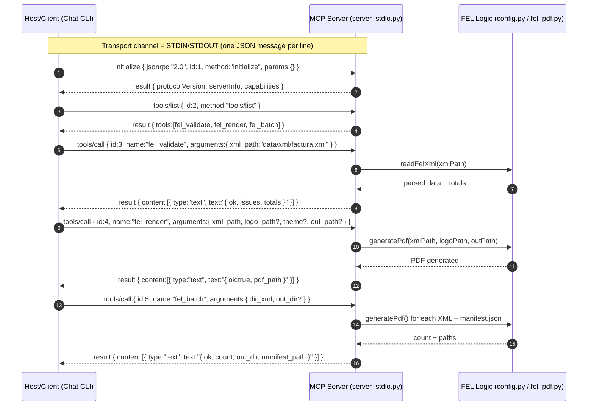

# MCP (Model Context Protocol) – FEL Server

This document describes the **MCP server** implemented without any SDK, using **STDIN/STDOUT + JSON-RPC 2.0**.  
It explains the execution flow, tool parameters, return values, and how to test the server from a terminal.

The design follows the **public MCP architecture** proposed by Anthropic.

## 1. MCP in this Context

* **Server (provider of capabilities)**: `server_stdio.py` exposes tools (`fel_validate`, `fel_render`, `fel_batch`) via **JSON-RPC 2.0** over STDIN/STDOUT.
* **Host / Client**: the process that spawns the server and issues MCP calls (e.g., the CLI chatbot).
* **Key messages**:
  * `initialize` -> handshake and capabilities declaration.
  * `tools/list` -> list of available tools.
  * `tools/call` -> invocation of a tool with arguments.

## 2. Sequence Diagram



## 3. Tool API

### 3.1 `fel_validate`

* **Description**: Validates a FEL XML file, checks **VAT 12%** and ensures `total = subtotal + VAT`. Verifies required fields.
* **Input (`arguments`)**:

  * `xml_path` *(string, required)* -> path to the FEL XML.
* **Return (`result.content[0].text`)**: JSON text:

```json
{
  "ok": true,
  "issues": [],
  "totals": { "subtotal": "8010.59", "iva": "961.27", "total": "8971.86" }
}
```

### 3.2 `fel_render`

* **Description**: Renders a **branded PDF** (logo, fonts, colors) from a FEL XML.
* **Input (`arguments`)**:

  * `xml_path` *(string, required)*
  * `logo_path` *(string|null, optional)* -> override logo path, default = `LOGO_PATH`.
  * `theme` *(string|null, optional)* -> reserved for future use.
  * `out_path` *(string|null, optional)* -> override output path, default = `OUTPUT_PDF`.
* **Return**:

```json
{ "ok": true, "pdf_path": "data/out/factura.pdf" }
```

### 3.3 `fel_batch`

* **Description**: Processes a directory of FEL XML files, generates one PDF per file, and builds a `manifest.json`.
* **Input (`arguments`)**:

  * `dir_xml` *(string, required)* -> directory with `*.xml`.
  * `out_dir` *(string|null, optional)* -> output directory, default = `data/out`.
* **Return**:

```json
{ "ok": true, "count": 5, "out_dir": "data/out", "manifest_path": "data/out/manifest.json" }
```

## 4. MCP Contract

* **Transport**: STDIN/STDOUT, one JSON message per line.
* **JSON-RPC Schema**: every request includes `jsonrpc:"2.0"`, `id`, `method`, `params?`.
* **Supported methods**:

  * `initialize` -> returns `{ protocolVersion, serverInfo, capabilities }`.
  * `tools/list` -> returns `{ tools:[...] }` including `name`, `description`, and `inputSchema`.
  * `tools/call` -> executes a tool with `{ name, arguments }` and responds with `{ result: { content:[...] } }`.
* **Errors**: JSON-RPC standard:

```json
{ "jsonrpc":"2.0", "id": <id>, "error": { "code": <int>, "message": "<desc>" } }
```

## 5. Environment & Parameters

The server reads configuration from `.env` via `config.py`:

* **Input/Output**:

  * `FEL_XML_PATH`, `FEL_LOGO_PATH`, `FEL_OUTPUT_PDF`
* **Fonts/Themes**:

  * `FEL_ACTIVE_FONT`, `FEL_FONT_DIR_MONTSERRAT`, `FEL_FONT_DIR_ROBOTOMONO`, `FEL_THEME`
* **Layout**:

  * `FEL_QR_SIZE`, `FEL_TOP_BAR_HEIGHT`
* **Footer Contact**:

  * `FEL_WEBSITE`, `FEL_PHONE`, `FEL_EMAIL`

At runtime, `fel_render` and `fel_batch` allow overriding default values via arguments.

## 6. Execution Flow

1. **Startup**: Host launches `server_stdio.py` as a subprocess.
2. **Handshake**: Host sends `initialize`; server responds with capabilities.
3. **Discovery**: Host calls `tools/list` to get available tools and JSON Schemas.
4. **Invocation**:

   * `fel_validate` -> parses XML, checks VAT & totals.
   * `fel_render` -> builds branded PDF.
   * `fel_batch` -> processes multiple XML files.
5. **Result**: server wraps responses into `result.content[0].text` (JSON as string).

## 7. CLI Test Examples

### 7.1 Initialize + List Tools

```bash
printf '%s\n' \
'{"jsonrpc":"2.0","id":1,"method":"initialize","params":{}}' \
'{"jsonrpc":"2.0","id":2,"method":"tools/list"}' \
| python servers/fel_mcp_server/server_stdio.py
```

### 7.2 Validate XML

```bash
printf '%s\n' \
'{"jsonrpc":"2.0","id":1,"method":"initialize","params":{}}' \
'{"jsonrpc":"2.0","id":2,"method":"tools/list"}' \
'{"jsonrpc":"2.0","id":3,"method":"tools/call","params":{"name":"fel_validate","arguments":{"xml_path":"data/xml/factura.xml"}}}' \
| python servers/fel_mcp_server/server_stdio.py
```

### 7.3 Render PDF

```bash
printf '%s\n' \
'{"jsonrpc":"2.0","id":1,"method":"initialize","params":{}}' \
'{"jsonrpc":"2.0","id":2,"method":"tools/list"}' \
'{"jsonrpc":"2.0","id":3,"method":"tools/call","params":{"name":"fel_render","arguments":{"xml_path":"data/xml/factura.xml","logo_path":"data/logos/logo.jpg","out_path":"data/out/factura.pdf"}}}' \
| python servers/fel_mcp_server/server_stdio.py
```

### 7.4 Batch Mode + Manifest

```bash
printf '%s\n' \
'{"jsonrpc":"2.0","id":1,"method":"initialize","params":{}}' \
'{"jsonrpc":"2.0","id":2,"method":"tools/list"}' \
'{"jsonrpc":"2.0","id":3,"method":"tools/call","params":{"name":"fel_batch","arguments":{"dir_xml":"data/xml","out_dir":"data/out"}}}' \
| python servers/fel_mcp_server/server_stdio.py
```

## 8. Relevant File Structure

```bash
servers/
└─ fel_mcp_server/
   ├─ server_stdio.py     # MCP server (no SDK)
   ├─ config.py           # Centralized parameters (.env driven)
   └─ fel_pdf.py          # readFelXml(), generatePdf(), helpers
```
