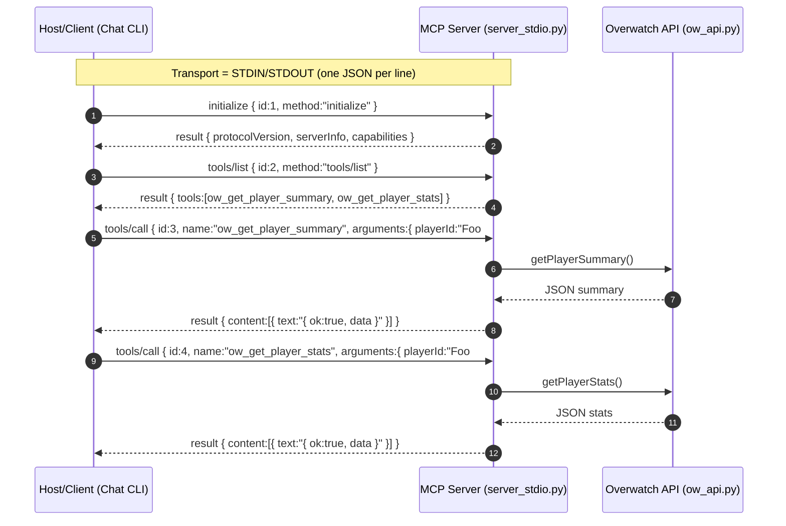

# MCP (Model Context Protocol) – Overwatch Server

This document describes the **Overwatch MCP server** implemented without an SDK, using **STDIN/STDOUT + JSON-RPC 2.0**.
It explains the execution flow, tool parameters, return values, and how to test the server from the terminal.

The design follows Anthropic’s **public MCP architecture**.

## 1. MCP in this Context

* **Server (capability provider)**: `server_stdio.py` exposes tools (`ow_get_player_summary`, `ow_get_player_stats`) via **JSON-RPC 2.0** over STDIN/STDOUT.
* **Host / Client**: the process that launches the server and sends MCP calls (e.g., the CLI chatbot).
* **Key Messages**:

  * `initialize` -> handshake and capability declaration.
  * `tools/list` -> list of available tools.
  * `tools/call` -> tool invocation with arguments.

## 2. Sequence Diagram



## 3. Tool API

### 3.1 `ow_get_player_summary`

* **Description**: Returns a player’s summary stats (winrate, kda, damage, healing), aggregated by role and hero.
* **Input (`arguments`)**:

  * `playerId` *(string, required)* -> Battletag (`Foo#1234` or `Foo-1234`).
  * `platform` *(string|null, optional)* -> one of: `pc`, `xbl`, `psn`, `nintendo`.
  * `gamemode` *(string|null, optional)* -> `quickplay` or `competitive`.
* **Return** (`result.content[0].text`): JSON string with aggregated data.

```json
{
  "ok": true,
  "endpoint": "summary",
  "playerId": "Foo#1234",
  "data": { "general": {...}, "roles": {...}, "heroes": {...} }
}
```

### 3.2 `ow_get_player_stats`

* **Description**: Returns detailed career stats with labels (similar to the career profile).
  **Requires** `platform` and `gamemode`.
* **Input (`arguments`)**:

  * `playerId` *(string, required)*
  * `platform` *(string, required)* -> `pc` | `console`
  * `gamemode` *(string, required)* -> `quickplay` | `competitive`
  * `hero` *(string|null, optional)* -> specific hero
* **Return**:

```json
{
  "ok": true,
  "endpoint": "stats",
  "playerId": "Foo#1234",
  "platform": "pc",
  "gamemode": "quickplay",
  "hero": null,
  "data": {...}
}
```

## 4. MCP Contract

* **Transport**: STDIN/STDOUT, one JSON per line.
* **Supported Methods**:

  * `initialize` -> `{ protocolVersion, serverInfo, capabilities }`
  * `tools/list` -> `{ tools:[...] }` including `name`, `description`, `inputSchema`
  * `tools/call` -> executes the tool and returns `{ result: { content:[...] } }`
* **Errors**:

```json
{ "jsonrpc":"2.0", "id": <id>, "error": { "code": <int>, "message": "<desc>" } }
```

## 5. CLI Examples

### 5.1 Initialize + List Tools

```bash
printf '%s\n' \
'{"jsonrpc":"2.0","id":1,"method":"initialize","params":{}}' \
'{"jsonrpc":"2.0","id":2,"method":"tools/list"}' \
| python servers/ow_mcp_server/server_stdio.py
```

### 5.2 Player Summary

```bash
printf '{"jsonrpc":"2.0","id":3,"method":"tools/call","params":{"name":"ow_get_player_summary","arguments":{"playerId":"YSE#11202","platform":"pc"}}}\n' \
| python servers/ow_mcp_server/server_stdio.py
```

### 5.3 Player Stats

```bash
printf '{"jsonrpc":"2.0","id":4,"method":"tools/call","params":{"name":"ow_get_player_stats","arguments":{"playerId":"YSE#11202","platform":"pc","gamemode":"quickplay"}}}\n' \
| python servers/ow_mcp_server/server_stdio.py
```

## 6. Testing the HTTP Server (Cloud Deployment Simulation)

In addition to `server_stdio.py`, the project also exposes an HTTP server using **FastAPI + Uvicorn**.
This allows you to test the MCP server locally as if it were already running on **Google Cloud Run or Fly.io**.

### 6.1 Start the HTTP Server

```bash
python -m uvicorn servers.ow_mcp_server.server_http:app --host 0.0.0.0 --port 8080
```

You should see in the console:

```bash
INFO:     Uvicorn running on http://0.0.0.0:8080 (Press CTRL+C to quit)
```

### 6.2 Install Utilities (Optional)

If you don’t have `jq` installed (for pretty-printing JSON):

```bash
sudo apt update && sudo apt install -y jq
```

### 6.3 Test Calls with `curl`

**Initialize:**

```bash
curl -s http://localhost:8080/mcp \
  -H "Content-Type: application/json" \
  -d '{"jsonrpc":"2.0","id":1,"method":"initialize"}' | jq
```

**List Tools:**

```bash
curl -s http://localhost:8080/mcp \
  -H "Content-Type: application/json" \
  -d '{"jsonrpc":"2.0","id":2,"method":"tools/list"}' | jq
```

**Player Summary:**

```bash
curl -s http://localhost:8080/mcp \
  -H "Content-Type: application/json" \
  -d '{"jsonrpc":"2.0","id":3,"method":"tools/call","params":{"name":"ow_get_player_summary","arguments":{"playerId":"YSE#11202","platform":"pc"}}}' | jq
```

**Player Stats:**

```bash
curl -s http://localhost:8080/mcp \
  -H "Content-Type: application/json" \
  -d '{"jsonrpc":"2.0","id":4,"method":"tools/call","params":{"name":"ow_get_player_stats","arguments":{"playerId":"YSE#11202","platform":"pc","gamemode":"quickplay"}}}' | jq
```

## 7. File Structure

```bash
servers/
└── ow_mcp_server/
    ├── README.md         # Usage documentation (this file)
    ├── __init__.py       # Marks the directory as a Python package
    ├── config.py         # Constants (platforms, gamemodes, etc.)
    ├── ow_api.py         # OverFast API wrappers (getPlayerSummary, getPlayerStats)
    ├── server_http.py    # MCP HTTP server (FastAPI/Uvicorn)
    └── server_stdio.py   # MCP STDIO server (JSON-RPC)
```
